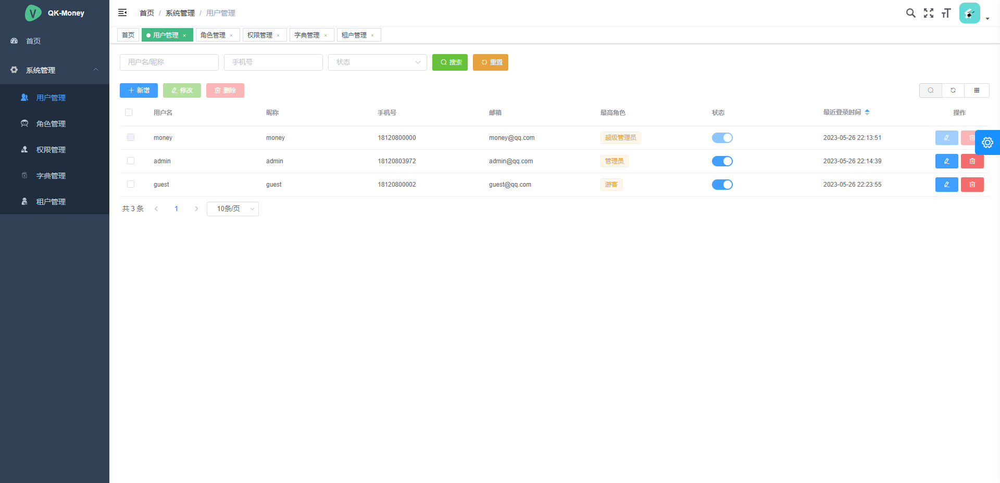
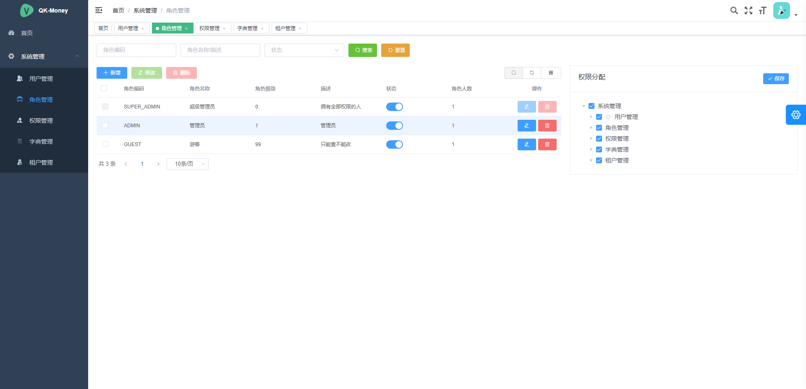
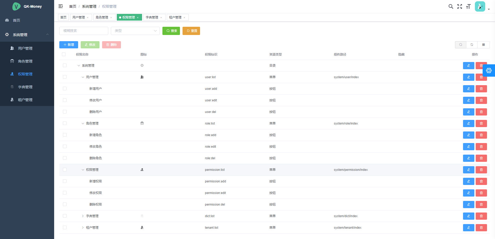
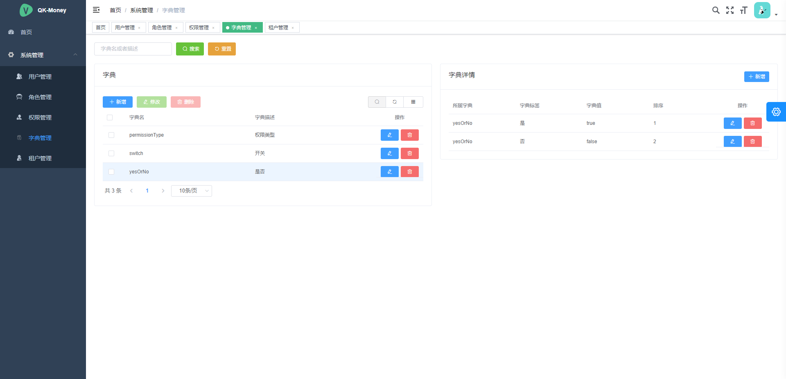
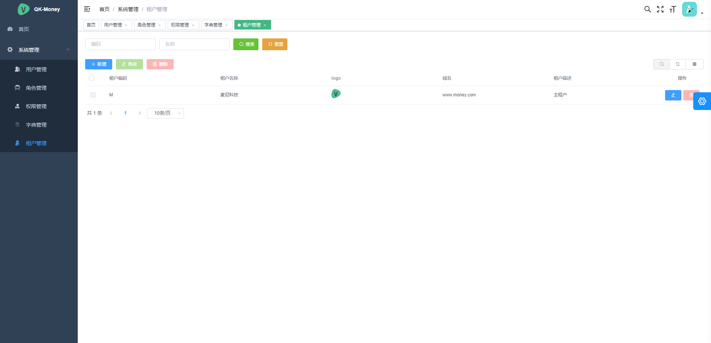

# Qk-Money-Web

See [QK-MONEY](https://github.com/ycf1998/qk-money)

## Project setup

```
npm install
```

### Compiles and hot-reloads for development

```
npm run dev
```

### Compiles and minifies for production

```
npm run build
```

### Screenshots










