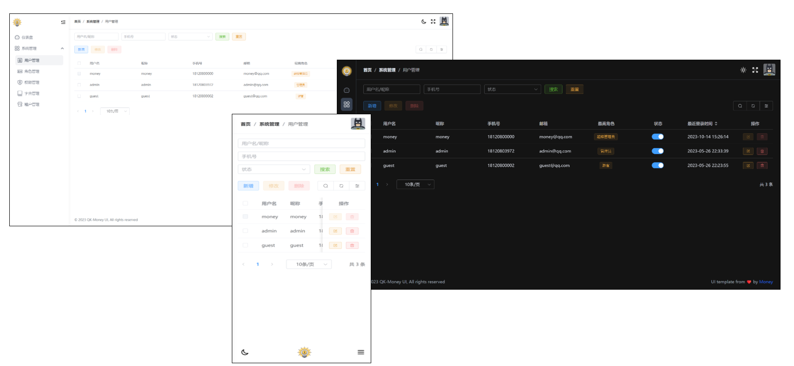

<h3 align="center">🎉 一个基于 Vue 3 和 Element Plus 的后台管理系统模板. </h3>

<p align="center">Money - VueJS 3 & Element Plus Admin UI Temlate</p>

> 配套后端：[QK-MONEY](https://github.com/ycf1998/qk-money)



## 技术栈

- [Vue 3](https://github.com/vuejs/vue-next)
- [Vue Router](https://router.vuejs.org/zh/)
- [Pinia](https://pinia.vuejs.org/zh/)
- [Element Plus](https://element-plus.org/zh-CN)
- [TailwindCSS](https://tailwindcss.com/)
- [Vite](https://vitejs.dev)

## 构建

#### 安装依赖

```
npm install
```

#### 本地启动

```
npm run dev
```

纯前端开发时，修改 [.env.development](./.env.development) 配置

```properties
# 填写该值开启纯前端模式，所有请求不会真实触发，使用 mock.js 里的数据。可选值：alert/log
VITE_ONLY_UI=log
VITE_TITLE=麦尼后台管理系统
VITE_BASE_URL=http://localhost:9000/qk-money
```

#### 打包

```
npm run build
```
